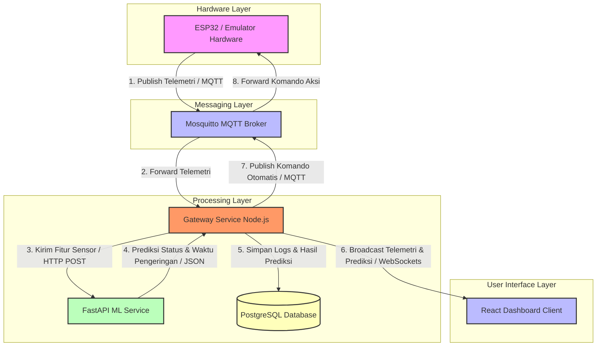
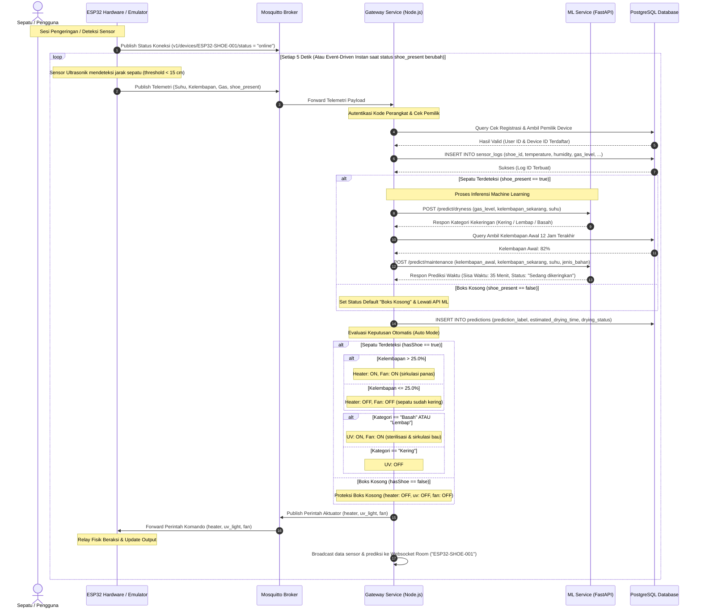
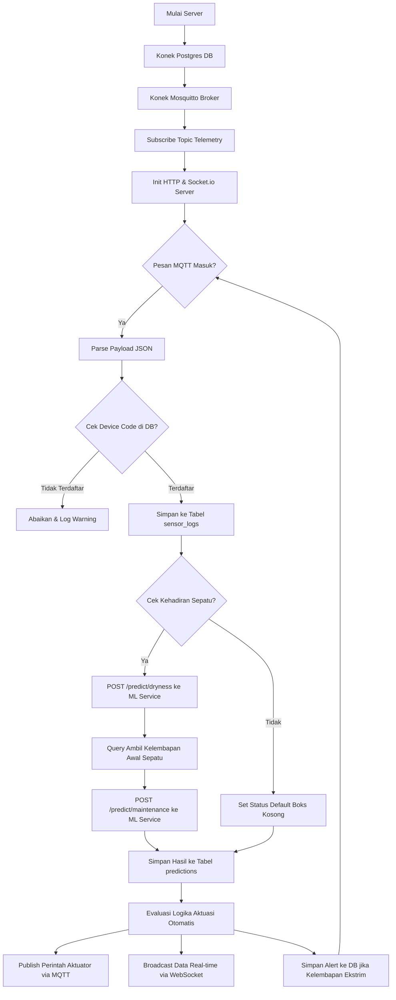
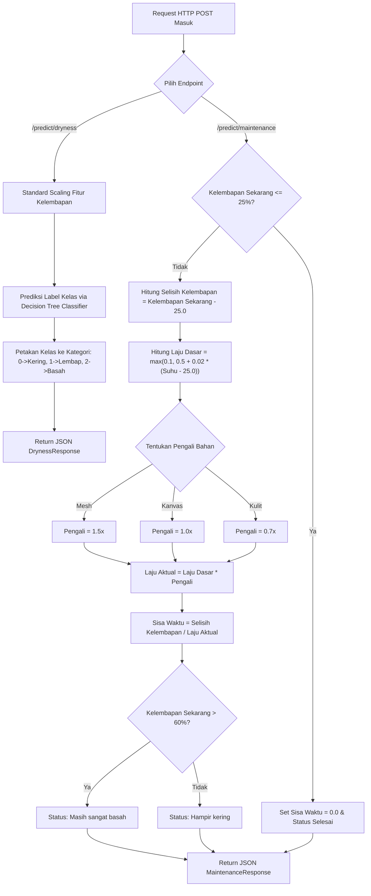
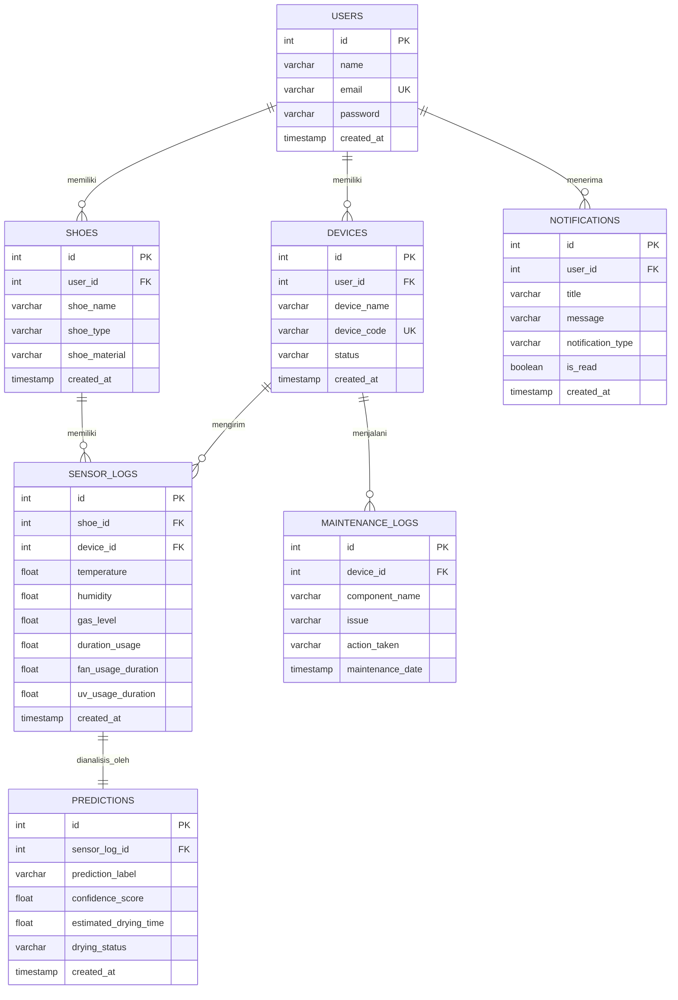
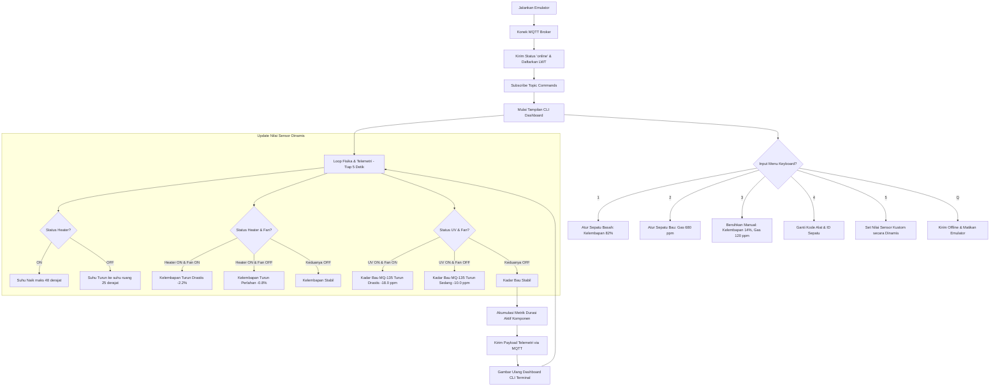

# Smart Shoes Maintenance - Sistem Pengering & Sterilisasi Sepatu Berbasis IoT & Machine Learning

Proyek **Smart Shoes Maintenance** adalah sistem pengering dan sterilisasi sepatu otomatis berbasis IoT (*Internet of Things*) yang terintegrasi dengan kecerdasan buatan (*Machine Learning*). Sistem ini dirancang untuk menjaga higienitas, kesegaran, dan memperpanjang umur sepatu secara pintar melalui kontrol otomatis berbasis kondisi fisik sepatu secara real-time.

Sistem ini memantau kondisi sepatu menggunakan sensor **DHT22** (Suhu & Kelembapan) dan **MQ-135** (Kadar Gas/Bau), lalu memproses data sensor tersebut menggunakan model Machine Learning untuk mengotomatisasi komponen fisik penunjang: **Heater (Pemanas)**, **Lampu UV Sterilisator (Pembunuh Bakteri)**, dan **Kipas Blower (Sirkulasi Udara)**.

---

## Fitur Utama Sistem

*   **Pengeringan & Sterilisasi Pintar**: Kontrol aktuasi pemanas, UV, dan blower secara otomatis (*Auto Mode*) berdasarkan hasil pembacaan sensor dan analisis model ML.
*   **Klasifikasi Kekeringan Tropis (Decision Tree Classifier)**: Mengklasifikasikan status kelembapan sepatu secara real-time berdasarkan data kelembapan dengan target tropis Indonesia (Kering $\le 50\%$, Lembap $50\% - 70\%$, Basah $> 70\%$).
*   **Estimasi Waktu Pengeringan (Matematika Heuristik)**: Memprediksi sisa waktu pengeringan sepatu dalam hitungan menit secara akurat berdasarkan tipe bahan sepatu (`Kanvas`, `Kulit`, `Mesh`) dan laju penguapan dinamis berbasis suhu heater.
*   **Otomatisasi & Proteksi Boks Kosong (Ultrasonic Interlock)**: Secara otomatis mendeteksi kehadiran sepatu menggunakan sensor ultrasonik (Boks Kosong jika jarak $\ge 15\text{ cm}$). Mematikan seluruh aktuator secara paksa untuk menghemat listrik dan menjaga keselamatan alat.
*   **Komunikasi Real-time (WebSockets & MQTT)**: Aliran data telemetri yang cepat tanpa jeda (*low-latency*) dari perangkat keras ke dashboard pengguna.
*   **Keamanan Terotentikasi (JWT)**: Dilengkapi otentikasi JSON Web Token untuk pendaftaran pengguna, pendaftaran alat, serta pencatatan pemeliharaan.

---

## Arsitektur Sistem Terintegrasi

Sistem ini dibangun menggunakan arsitektur microservices modern yang diwadahi oleh Docker Compose untuk kemudahan orkestrasi.



---

## Alur Program Umum (End-to-End Flow)

Diagram urutan berikut menggambarkan siklus hidup pengiriman data sensor dari perangkat ESP32 ke sistem backend hingga terjadinya respon aktuasi otomatis di perangkat keras:



---

## Arsitektur & Alur Per-Service

Setiap service dirancang secara modular dan efisien dengan tanggung jawab yang spesifik.

### 1. Gateway Service (Node.js & Express)
Merupakan pusat orkestrasi sistem. Bertindak sebagai *subscriber* MQTT untuk menerima telemetri, berinteraksi dengan basis data PostgreSQL, memanggil API ML Service, serta menyebarkan pembaruan data secara real-time kepada pengguna melalui WebSocket.



*   **Port Default**: `3000`
*   **Path WebSocket**: `ws://localhost:3000/realtime`
*   **Rute Utama REST API**: `/api/v1` (Registrasi, Login, Manajemen Sepatu, Logs, Notifikasi)

---

### 2. ML Service (FastAPI)
Layanan berbasis Python yang menyediakan endpoint REST API berkinerja tinggi untuk melakukan komputasi prediksi secara realtime menggunakan model matematika yang telah dilatih sebelumnya.



*   **Port Default**: `8000`
*   **Model Klasifikasi Kekeringan**: Menggunakan *Decision Tree Classifier (3-Node)* berbasis fitur tunggal kelembapan untuk menentukan status kekeringan tropis (Kering $\le 50\%$, Lembap $50\% - 70\%$, Basah $> 70\%$).
*   **Model Estimasi Waktu**: Menggunakan *Matematika Heuristik* untuk menghitung estimasi menit tersisa hingga kelembapan menyentuh batas optimal ($25\%$) berdasarkan tipe bahan sepatu (Mesh $1.5\times$, Kanvas $1.0\times$, Kulit $0.7\times$) dan laju pengeringan dinamis berbasis suhu box.

---

### 3. Database Schema (PostgreSQL)

Skema database dirancang untuk memastikan integritas data telemetri, riwayat pemeliharaan alat, hasil prediksi ML, dan notifikasi pengguna terjaga dengan baik.



---

### 4. Interactive ESP32 Emulator (Node.js)
Menyimulasikan kondisi fisik perangkat keras pengering sepatu di dalam terminal. Emulator memproses rumus perubahan fisika secara dinamis bergantung pada status saklar aktuator yang ia terima dari Gateway Service.



> [!NOTE]
> Pada **perangkat fisik ESP32**, kehadiran sepatu dideteksi secara dinamis via sensor **Ultrasonik HC-SR04 / AJ-SR04M** (jarak $\ge 15\text{ cm}$ berarti boks kosong). Pada **Emulator**, status kehadiran sepatu dikontrol secara logis via parameter ID Sepatu (`active_shoe_id` terdaftar di database). Jika `active_shoe_id` bernilai `0` (atau `null`), sistem secara otomatis mengaktifkan fitur proteksi boks kosong.

---

## Panduan Menjalankan Sistem (Quick Start)

### Prasyarat System
*   Docker & Docker Desktop terinstal.
*   Node.js (versi >= 16) terinstal secara lokal di komputer Anda.

### Langkah 1: Jalankan Ekosistem Menggunakan Docker
Jalankan perintah berikut di root folder proyek untuk membangun dan menyalakan PostgreSQL database, Mosquitto MQTT broker, ML Service, dan Gateway Service secara terpadu:
```bash
docker compose up --build
```

### Langkah 2: Jalankan ESP32 Emulator
Buka terminal baru di komputer Anda, masuk ke dalam folder `scripts`, lalu aktifkan emulator:
```bash
cd scripts
node emulator.js --device ESP32-SHOE-001 --shoe 1
```

### Langkah 3: Gunakan Menu Interaktif Emulator
Gunakan tombol angka `1` s.d `4` pada keyboard terminal emulator untuk menyimulasikan berbagai skenario pengeringan sepatu Anda dan saksikan bagaimana sistem cerdas Machine Learning mengotomatisasi saklar perangkat keras secara instan!
