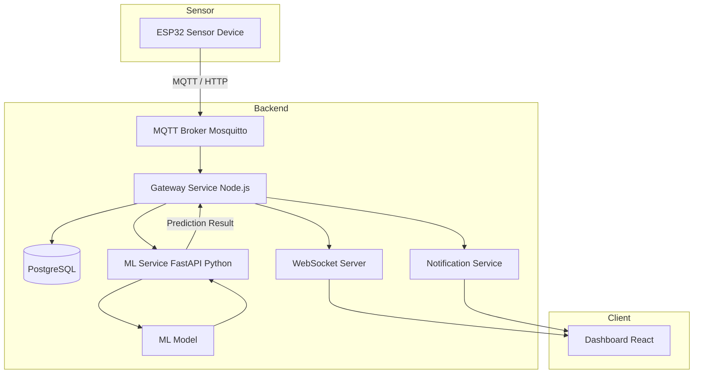
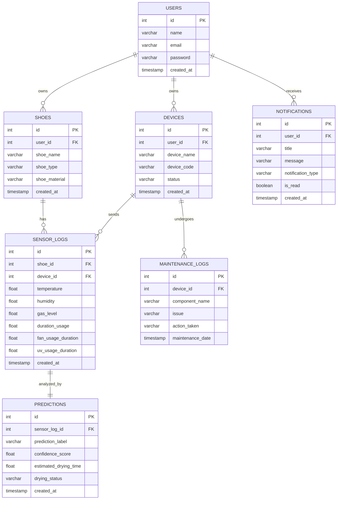

# Smart Shoes Maintenance Architecture Overview

## System Overview
Smart Shoes Maintenance adalah proyek IoT untuk membuat pengering sepatu berbasis IoT dengan fungsi mengeringkan sepatu dengan heater, membunuh bakteri dengan UV, dan membuat sepatu menjadi segar kembali. Proyek ini menggunakan komponen sensor: DHT22 dan MQ-135

## System Architecture


## Architectural Layers
```
smart-shoe-iot/
│
├── docker-compose.yml
├── .env
├── README.md
│
├── gateway-service/
│   ├── src/
│   │   ├── config/
│   │   ├── controllers/
│   │   ├── routes/
│   │   ├── services/
│   │   ├── repositories/
│   │   ├── middleware/
│   │   ├── websocket/
│   │   ├── mqtt/
│   │   ├── utils/
│   │   ├── models/
│   │   └── app.js
│   │
│   ├── server.js
│   ├── package.json
│   └── Dockerfile
│
├── ml-service/
│   ├── app/
│   │   ├── main.py
│   │   ├── routes/
│   │   ├── services/
│   │   ├── models/
│   │   └── utils/
│   │
│   ├── training/
│   │   ├── train.py
│   │   └── preprocessing.py
│   │
│   ├── dataset/
│   │   └── shoe_sensor.csv
│   │
│   ├── trained_model/
│   │   ├── model.pkl
│   │   └── scaler.pkl
│   │
│   ├── requirements.txt
│   └── Dockerfile
│
├── dashboard-client/
│   ├── src/
│   │   ├── components/
│   │   ├── pages/
│   │   ├── services/
│   │   ├── hooks/
│   │   ├── context/
│   │   └── App.jsx
│   │
│   ├── public/
│   ├── package.json
│   └── Dockerfile
│
├── notification-service/
│   ├── src/
│   │   ├── websocket/
│   │   ├── services/
│   │   └── app.js
│   │
│   ├── package.json
│   └── Dockerfile
│
├── mqtt-broker/
│   └── mosquitto.conf
│
├── database/
│   ├── migrations/
│   ├── seed/
│   └── init.sql
│
├── docs/
│   ├── architecture.md
│   ├── erd.md
│   ├── api-docs.md
│   └── websocket-flow.md
│
└── scripts/
    ├── start.sh
    └── migrate.sh
```

## Skema Database


## Machine Learning Overview

Machine Learning pada sistem Smart Shoe IoT digunakan untuk:

1. Mengklasifikasikan tingkat kekeringan sepatu (Kering, Lembap, Basah) menggunakan **Decision Tree Classifier**.
2. Memprediksi sisa waktu pengeringan sepatu secara dinamis menggunakan **Matematika Heuristik** berbasis suhu dan jenis bahan sepatu.

Sistem menerima data sensor dari perangkat IoT kemudian dikirim oleh Gateway Service (Node.js) ke ML Service (FastAPI) menggunakan HTTP REST API secara synchronous untuk diproses oleh model machine learning guna menghasilkan prediksi secara realtime.

### 1. Klasifikasi Kekeringan Menggunakan Decision Tree Classifier

#### Tujuan

Model Decision Tree Classifier (3-Node) digunakan untuk menentukan tingkat kekeringan sepatu secara objektif ke dalam 3 level target tropis Indonesia (Kering, Lembap, Basah) berbasis fitur tunggal kelembapan (`humidity`).

#### Input Feature

Data yang digunakan:

- Humidity (DHT22)

#### Output

Model menghasilkan kategori/label:

- Kering (Label 0) -> kelembapan $\le 50\%$
- Lembap (Label 1) -> kelembapan $50\% - 70\%$
- Basah (Label 2) -> kelembapan $> 70\%$

#### Cara Kerja

Decision Tree Classifier bekerja dengan mengevaluasi kondisi kelembapan saat ini menggunakan aturan percabangan terstruktur untuk memetakan kelembapan ke kelas kekeringan yang sesuai secara non-linear.

### 2. Estimasi Waktu Pengeringan Menggunakan Matematika Heuristik

#### Tujuan

Memprediksi sisa waktu pengeringan sepatu dalam menit secara dinamis berdasarkan kondisi fisik heater dan material sepatu.

#### Input Feature

Data yang digunakan:
- Kelembapan Awal (%)
- Kelembapan Sekarang (%)
- Suhu Box/Heater (°C)
- Jenis Bahan Sepatu (Mesh, Kanvas, Kulit)

#### Output
```
Estimasi sisa waktu pengeringan: 35.5 menit lagi
```

#### Cara Kerja

Estimasi sisa waktu dihitung secara dinamis menggunakan persamaan berikut:
1. Target pengeringan optimal diatur pada kelembapan $25.0\%$. Jika kelembapan saat ini sudah di bawah target, sisa waktu diatur ke $0$.
2. Laju pengeringan dasar dihitung berdasarkan suhu heater:
   $$\text{laju\_dasar} = \max(0.1, 0.5 + 0.02 \times (\text{suhu} - 25.0))$$
3. Nilai ini kemudian disesuaikan berdasarkan material pengali bahan:
   - Mesh: $1.5\times$ (struktur berpori mempercepat penguapan)
   - Kanvas: $1.0\times$ (laju standard)
   - Kulit: $0.7\times$ (material tebal memperlambat penguapan)
4. Sisa waktu pengeringan diperoleh dari pembagian selisih kelembapan ke target dengan laju aktual:
   $$\text{sisa\_waktu} = \frac{\text{kelembapan\_sekarang} - 25.0}{\text{laju\_dasar} \times \text{pengali\_bahan}}$$

## Tools dan Library
### Frontend
- React.js (Vite)
- Vanilla CSS / TailwindCSS
- Recharts / Chart.js (untuk visualisasi grafik sensor realtime)
- WebSocket Client
### Backend
- Node.js
- Express.js
- WebSocket
### Machine Learning
- Python
- Scikit-learn
- Pandas
- NumPy
### Database
- PostgreSQL
