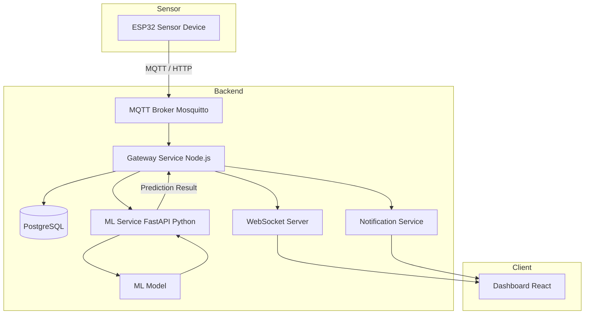
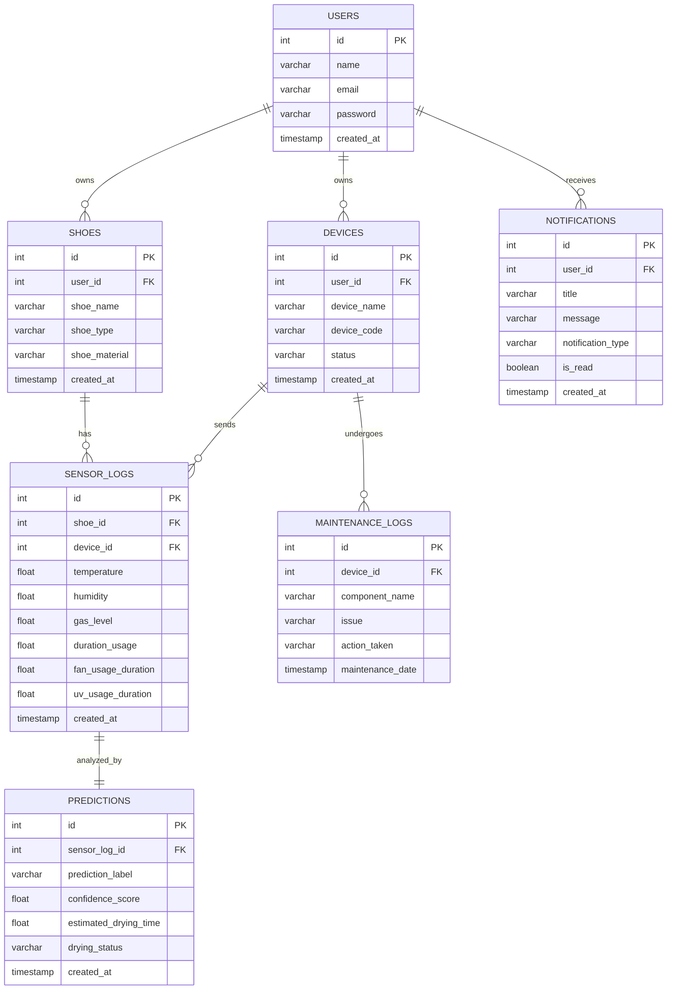

# Smart Shoes Maintenance Architecture Overview

## System Overview
Smart Shoes Maintenance adalah proyek IoT untuk membuat pengering sepatu berbasis IoT dengan fungsi mengeringkan sepatu dengan heater, membunuh bakteri dengan UV, dan membuat sepatu menjadi segar kembali. Proyek ini menggunakan komponen sensor: DHT22 dan MQ-135

## System Architecture


## Architectural Layers
```
smart-shoe-iot/
│
├── docker-compose.yml
├── .env
├── README.md
│
├── gateway-service/
│   ├── src/
│   │   ├── config/
│   │   ├── controllers/
│   │   ├── routes/
│   │   ├── services/
│   │   ├── repositories/
│   │   ├── middleware/
│   │   ├── websocket/
│   │   ├── mqtt/
│   │   ├── utils/
│   │   ├── models/
│   │   └── app.js
│   │
│   ├── server.js
│   ├── package.json
│   └── Dockerfile
│
├── ml-service/
│   ├── app/
│   │   ├── main.py
│   │   ├── routes/
│   │   ├── services/
│   │   ├── models/
│   │   └── utils/
│   │
│   ├── training/
│   │   ├── train.py
│   │   └── preprocessing.py
│   │
│   ├── dataset/
│   │   └── shoe_sensor.csv
│   │
│   ├── trained_model/
│   │   ├── model.pkl
│   │   └── scaler.pkl
│   │
│   ├── requirements.txt
│   └── Dockerfile
│
├── dashboard-client/
│   ├── src/
│   │   ├── components/
│   │   ├── pages/
│   │   ├── services/
│   │   ├── hooks/
│   │   ├── context/
│   │   └── App.jsx
│   │
│   ├── public/
│   ├── package.json
│   └── Dockerfile
│
├── notification-service/
│   ├── src/
│   │   ├── websocket/
│   │   ├── services/
│   │   └── app.js
│   │
│   ├── package.json
│   └── Dockerfile
│
├── mqtt-broker/
│   └── mosquitto.conf
│
├── database/
│   ├── migrations/
│   ├── seed/
│   └── init.sql
│
├── docs/
│   ├── architecture.md
│   ├── erd.md
│   ├── api-docs.md
│   └── websocket-flow.md
│
└── scripts/
    ├── start.sh
    └── migrate.sh
```

## Skema Database


## Machine Learning Overview

Machine Learning pada sistem Smart Shoe IoT digunakan untuk:

1. Mengklasifikasikan tingkat bau sepatu
2. Memprediksi waktu maintenance alat

Sistem menerima data sensor dari perangkat IoT kemudian dikirim oleh Gateway Service (Node.js) ke ML Service (FastAPI) menggunakan HTTP REST API secara synchronous untuk diproses oleh model machine learning guna menghasilkan prediksi secara realtime.

### 1. Klasifikasi Bau Menggunakan K-Means Clustering

#### Tujuan

Model K-Means digunakan untuk menentukan kondisi tingkat bau sepatu berdasarkan data sensor.

#### Input Feature

Data yang digunakan:

- Gas Level (MQ-135)
- Humidity (DHT22)

#### Output

Model menghasilkan kategori/label:

- Wangi (Cluster 0)
- Normal (Cluster 1)
- Bau (Cluster 2)

#### Cara Kerja

K-Means bekerja dengan mengelompokkan data sensor gas MQ-135 dan kelembapan saat ini secara objektif ke dalam 3 klaster optimal yang masing-masing merepresentasikan tingkat kesegaran sepatu (Wangi, Normal, Bau).

Model memetakan data baru ke klaster terdekat berdasarkan nilai centroid yang telah dipelajari selama proses training.

Contoh:

```text id="h6p2nr"
Humidity: 82
Gas Level: 510
Temperature: 31
```

misal hasil :
```
BAU_PARAH
```

### 2. Prediksi Maintenance Menggunakan Linear Regression

#### Tujuan
Model Linear Regression digunakan untuk memperkirakan kapan alat membutuhkan maintenance.

#### Input Feature
Data yang digunakan:
- Average Humidity
- Average Gas Level
- Total Usage
- Fan Usage Duration
- UV Usage Duration

#### Output
```
Estimasi waktu maintenance: 1 jam lagi maintenance
```

#### Cara Kerja
Linear Regression mencari hubungan linear antara data sensor dan waktu maintenance.

## Tools dan Library
### Frontend
- React.js (Vite)
- Vanilla CSS / TailwindCSS
- Recharts / Chart.js (untuk visualisasi grafik sensor realtime)
- WebSocket Client
### Backend
- Node.js
- Express.js
- WebSocket
### Machine Learning
- Python
- Scikit-learn
- Pandas
- NumPy
### Database
- PostgreSQL
