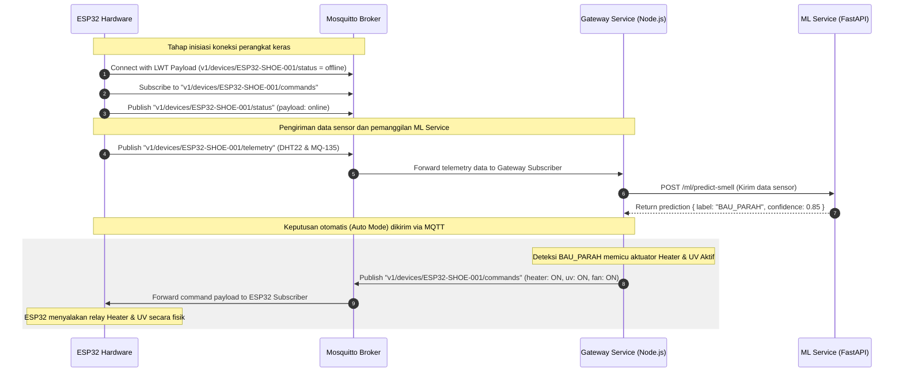

# Smart Shoes Maintenance - MQTT Specification

Dokumen ini mendefinisikan spesifikasi protokol komunikasi MQTT (Message Queuing Telemetry Transport) yang digunakan untuk menghubungkan perangkat sensor ESP32 dengan Gateway Service melalui Broker Mosquitto secara realtime dan efisien.

---

## 1. Konfigurasi Broker MQTT

*   **Protokol**: MQTT v3.1.1
*   **Port Standar**: `1883` (TCP/tanpa enkripsi) atau `8883` (MQTTS/dengan SSL/TLS untuk produksi)
*   **Keep Alive Interval**: `60 detik`
*   **Client ID Perangkat**: Harus berformat unik untuk menghindari pemutusan koneksi akibat konflik, direkomendasikan menggunakan format: `ESP32_SHOE_<MAC_ADDRESS>` (misal: `ESP32_SHOE_30AEA4070F14`).

---

## 2. Hirarki Topik MQTT

Rancangan topik MQTT menggunakan pola terstruktur berbasis versi dan identifikasi unik perangkat:

```text
v1/devices/{device_code}/{type}/{sub_type}
```

Berikut adalah daftar topik yang digunakan dalam sistem:

| Peran | Topik MQTT | Deskripsi | QoS | Retain |
| :--- | :--- | :--- | :--- | :--- |
| **Publish (ESP32)** | `v1/devices/{device_code}/status` | Status koneksi perangkat (Online / Offline LWT) | 1 | True |
| **Publish (ESP32)** | `v1/devices/{device_code}/telemetry` | Data sensor berkala dari DHT22 dan MQ-135 | 0 | False |
| **Subscribe (ESP32)**| `v1/devices/{device_code}/commands` | Perintah aksi aktuator (Heater, UV, Kipas) | 1 | False |

*(Catatan: `{device_code}` diganti dengan kode unik masing-masing alat, contoh: `ESP32-SHOE-001`).*

---

## 3. Spesifikasi Payload JSON

Semua pesan yang dipublikasikan dan dilanggan menggunakan format JSON.

### A. Perangkat Online & Offline (Last Will and Testament)

Topik `v1/devices/{device_code}/status` digunakan untuk memantau apakah perangkat sedang terhubung ke internet.

#### Pesan Status Online
Dipublikasikan oleh ESP32 segera setelah berhasil melakukan jabat tangan (handshake) dengan Broker MQTT.
*   **Payload**:
```json
{
  "device_code": "ESP32-SHOE-001",
  "status": "online",
  "timestamp": "2026-05-22T11:00:00.000Z"
}
```

#### Pesan Status Offline (Last Will and Testament / LWT)
Dikonfigurasi oleh ESP32 pada Broker saat inisiasi koneksi. Broker Mosquitto akan otomatis mempublikasikan pesan ini jika perangkat terputus secara mendadak (lost connection/lost ping).
*   **Payload**:
```json
{
  "device_code": "ESP32-SHOE-001",
  "status": "offline",
  "timestamp": "2026-05-22T11:15:30.000Z"
}
```

---

### B. Pengiriman Data Sensor (Telemetry)

Dipublikasikan secara periodik oleh ESP32 ke topik `v1/devices/{device_code}/telemetry` (misalnya setiap 5 atau 10 detik sekali saat alat aktif bekerja).

*   **Payload**:
```json
{
  "device_code": "ESP32-SHOE-001",
  "shoe_id": 1,
  "telemetry": {
    "temperature": 32.5,
    "humidity": 82.0,
    "gas_level": 512.0
  },
  "metrics": {
    "duration_usage": 4.5,
    "fan_usage_duration": 1.2,
    "uv_usage_duration": 0.8
  },
  "timestamp": "2026-05-22T11:12:00.000Z"
}
```

**Keterangan Parameter:**
- `telemetry.temperature`: Suhu pengeringan dalam derajat Celsius (DHT22).
- `telemetry.humidity`: Kelembapan relatif dalam persen (DHT22).
- `telemetry.gas_level`: Tingkat bau sepatu dalam satuan PPM atau Analog Value (MQ-135).
- `metrics.duration_usage`: Lama total sepatu diletakkan di alat (jam).
- `metrics.fan_usage_duration`: Durasi aktif kipas blower pengering (jam).
- `metrics.uv_usage_duration`: Durasi aktif lampu sterilisasi bakteri UV (jam).

---

### C. Kontrol Aktuator (Commands)

Gateway Service mempublikasikan pesan ke topik `v1/devices/{device_code}/commands` untuk mengendalikan komponen fisik pada pengering sepatu. ESP32 wajib melakukan subscribe ke topik ini.

*   **Payload**:
```json
{
  "command_id": "cmd_9d5b6272",
  "device_code": "ESP32-SHOE-001",
  "actuators": {
    "heater": "ON",
    "uv_light": "OFF",
    "fan": "ON"
  },
  "mode": "auto",
  "timestamp": "2026-05-22T11:12:02.000Z"
}
```

**Keterangan Parameter:**
- `command_id`: ID unik perintah untuk pelacakan log aksi.
- `actuators.heater`: Perintah status pemanas (`ON` / `OFF`).
- `actuators.uv_light`: Perintah status lampu UV pembunuh bakteri (`ON` / `OFF`).
- `actuators.fan`: Perintah status blower kipas (`ON` / `OFF`).
- `mode`: Mode kerja alat.
  - `auto`: Diatur otomatis oleh Gateway berdasarkan hasil prediksi model klasifikasi bau ML (FastAPI).
  - `manual`: Diatur langsung secara manual oleh pengguna melalui tombol di Dashboard React.

---

## 4. Aliran Komunikasi MQTT & Integrasi ML

Diagram di bawah menggambarkan skenario ketika ESP32 mengirim data telemetry, Gateway memanggil ML Service secara synchronous via HTTP, dan Gateway mengirim balik instruksi kontrol otomatis (jika bau parah terdeteksi) kembali ke ESP32 menggunakan MQTT.


