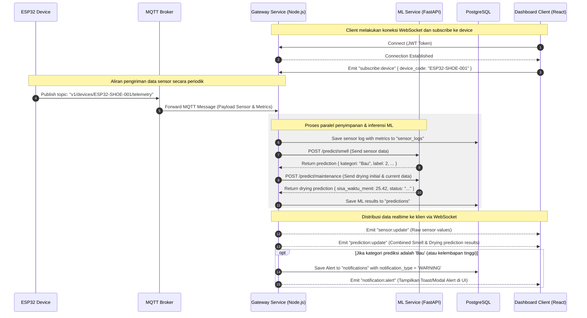

# Smart Shoes Maintenance - WebSocket Flow Documentation

Dokumen ini menjelaskan alur komunikasi realtime berbasis WebSocket pada sistem Smart Shoes Maintenance. WebSocket digunakan untuk mengirimkan data sensor realtime dari Gateway ke Dashboard Client secara langsung tanpa memerlukan polling berkala, serta untuk mengirimkan notifikasi instan (alert) kepada pengguna ketika sistem mendeteksi kondisi tidak normal pada sepatu atau kebutuhan pemeliharaan alat.

---

## 1. Arsitektur Aliran WebSocket

WebSocket server berjalan di dalam Gateway Service (Node.js) menggunakan Socket.io atau pustaka ws standar. Aliran data secara garis besar adalah sebagai berikut:

```text
+-----------------------+              +-----------------------+              +------------------------+
|  ESP32 Sensor Device  | --(MQTT)-->  |  Gateway Service JS   | --(WS Push)-->|    Dashboard Client    |
| (Kirim Data Berkala)  |              |  (Proses & Panggil ML)|              | (Update Grafik & Alert)|
+-----------------------+              +-----------------------+              +------------------------+
```

---

## 2. Koneksi & Autentikasi

### Koneksi Handshake
* **WebSocket URL**: `ws://localhost:3000/realtime`
* **Protokol**: Socket.io atau Native WebSockets (ditentukan oleh implementasi client).
* **Autentikasi**: Token JWT harus dikirimkan pada query string saat koneksi awal dilakukan (handshake) untuk memvalidasi identitas pengguna dan membatasi data yang diterima agar hanya sesuai dengan perangkat milik pengguna tersebut.

Contoh URL Handshake:
`ws://localhost:3000/realtime?token=eyJhbGciOiJIUzI1NiIsInR5cCI6IkpXVCJ9...`

---

## 3. Kejadian (Events) dan Struktur Payload

### A. Client-to-Server Events

#### 1. `subscribe:device`
Digunakan oleh Dashboard Client untuk mendaftarkan ketertarikan pada log sensor realtime dari perangkat tertentu.
* **Payload**:
```json
{
  "device_code": "ESP32-SHOE-001"
}
```

#### 2. `unsubscribe:device`
Digunakan oleh Dashboard Client untuk berhenti berlangganan dari data realtime suatu perangkat (misalnya saat berpindah halaman).
* **Payload**:
```json
{
  "device_code": "ESP32-SHOE-001"
}
```

---

### B. Server-to-Client Events (Broadcast)

#### 1. `sensor:update`
Dikirimkan oleh server setiap kali Gateway menerima data baru dari ESP32 (baik via HTTP POST maupun MQTT).
* **Payload**:
```json
{
  "device_code": "ESP32-SHOE-001",
  "shoe_id": 1,
  "data": {
    "temperature": 32.5,
    "humidity": 82.0,
    "gas_level": 512.0,
    "timestamp": "2026-05-22T11:12:00.000Z"
  }
}
```

#### 2. `prediction:update`
Dikirimkan bersamaan atau segera setelah data sensor diproses oleh ML Service (FastAPI) untuk memperbarui kondisi sepatu secara realtime di dashboard.
* **Payload**:
```json
{
  "device_code": "ESP32-SHOE-001",
  "shoe_id": 1,
  "prediction": {
    "smell": {
      "label": 2,
      "kategori": "Bau",
      "gas_mq135_normalisasi": 0.8543,
      "kelembapan_normalisasi": 0.7812
    },
    "drying": {
      "estimated_drying_time": 25.42,
      "drying_status": "Sedang dikeringkan (Kondisi sepatu hampir kering)"
    },
    "timestamp": "2026-05-22T11:12:00.321Z"
  }
}
```

#### 3. `notification:alert`
Dikirimkan secara instan ke Dashboard Client ketika sistem mendeteksi kondisi darurat atau membutuhkan tindakan pengguna (misalnya sepatu berstatus 'Bau' atau kelembapan sangat tinggi).
* **Payload**:
```json
{
  "user_id": 1,
  "notification_type": "WARNING",
  "title": "Peringatan Kelembapan/Bau Sepatu!",
  "message": "Sepatu pada perangkat ESP32-SHOE-001 terdeteksi sangat lembap / berbau kurang sedap. Sistem merekomendasikan sterilisasi UV dan Heater diaktifkan.",
  "timestamp": "2026-05-22T11:12:01.000Z"
}
```

---

## 4. Diagram Alir Sequence (Sequence Diagram)

Berikut adalah urutan interaksi realtime saat data sensor dikirimkan oleh perangkat keras hingga diterima oleh pengguna melalui antarmuka web:



---

## 5. Manajemen Siklus Hidup Koneksi (Connection Lifecycle)

### A. Heartbeat (Ping/Pong)
Untuk menjaga agar koneksi WebSocket tidak ditutup secara sepihak oleh firewall atau router proxy, Gateway Service akan mengirimkan event `ping` secara berkala (default: 25 detik), dan Dashboard Client harus membalas secara otomatis dengan `pong`.

### B. Strategi Reconnection
Jika koneksi internet terputus secara tidak terduga:
1. Dashboard Client harus mencoba melakukan koneksi ulang (reconnect) secara otomatis sebanyak maksimal 5 kali dengan jeda waktu yang meningkat secara eksponensial (exponential backoff, misal: 1 detik, 2 detik, 4 detik, dst).
2. Selama masa terputus, Dashboard Client harus menampilkan status koneksi indikator "Terputus, mencoba menghubungkan kembali..." pada pojok antarmuka pengguna.
3. Setelah koneksi tersambung kembali, Dashboard Client wajib mengirimkan kembali event `subscribe:device` untuk memastikan server mengirimkan ulang data aliran terbaru.
